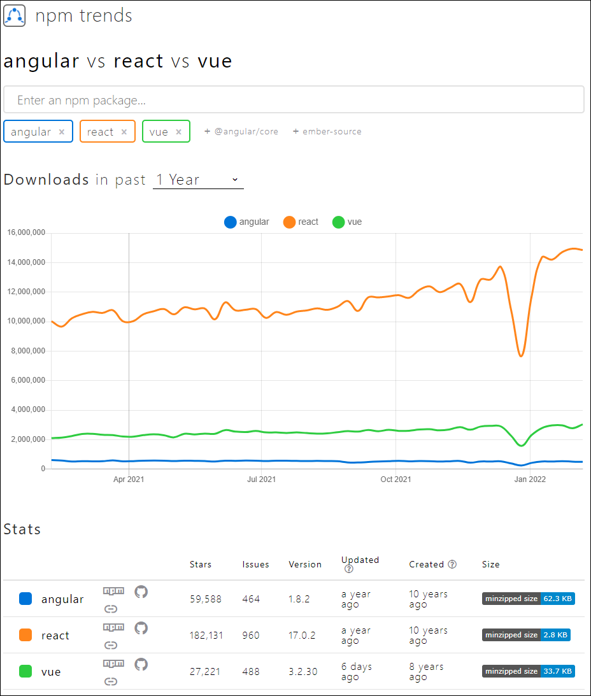

# 01. 리액트 시작하기 

## 01-1 리액트의 정체를 알아보자

* npm trends (2022년 2월에서 최근 1년간 다운로드 수)

  

  리액트가 가장 다운로드가 많긴함..

* 리액트의 가장 큰 특징

  `화면 출력이 특화된 프레임 워크`

  1. 컴포넌트로 화면 구성을 효율 적으로 할 수 있음.

  2. 게임 엔진 원리를 도입하여 화면 출력 속도가 빠름.

     * [가상 돔과 돔의 차이점](https://github.com/FEDevelopers/tech.description/wiki/%EA%B0%80%EC%83%81-%EB%8F%94%EA%B3%BC-%EB%8F%94%EC%9D%98-%EC%B0%A8%EC%9D%B4%EC%A0%90)

       

* npm : 노드 패키지 매니저

  * https://www.npmjs.cmo에서 필요한 라이브러리를 내려받아 설치하고 삭제하는 등의 관리를 해주는 프로그램

* 웹팩

  * 프로젝트에 사용된 파일을 분석하여 기존 웹 문서 파일로 변환하는 도구

  

## 01-02 리액트 개발환경 설치하기

* 스터디 실행환경

  ```
  C:\>nvm list
  
      17.5.0
      16.14.0
      14.19.0
    * 10.24.1 (Currently using 64-bit executable) // 2021년 4월 26일을 마지막으로 업데이트가 없다.
  
  C:\>nvm use 10.24.1
  Now using node v10.24.1 (64-bit)
  
  C:\>
  ```

  * 책에선 예제를 실행하기 위한 용도로 사용하여 NodeJS의 버전은 리액트 학습과 큰 관련이 없다고 한다.
    * 2022년 2월 현시점 기준으로는 버전이 좀 낮긴함.


* yarn 설치

  ```
  npm install -g yarn
  ```

* create-react-app 설치

  ```
  yarn create react-app do-it-example --script-version 2.1.7
  ```

  * **스크립트 버전을 지정하는 것이 매우 중요하다.**


#### 예제에 필요한 라이브러리 미리 설치하기

* https://github.com/justinpark/justin-do-it-react/blob/master/package.json

  * 위 내용에서 1장에 필요한 부분만 남기고 지웠다. , script 부분에 아직 진행하지 못한 시작 방법 부분 제거

    

* babel-loader 호환성 오류 해결

  ```
  Manually installing incompatible versions is known to cause hard-to-debug issues.
  
  If you would prefer to ignore this check, add SKIP_PREFLIGHT_CHECK=true to an .env file in your project.
  That will permanently disable this message but you might encounter other issues.
  ```

  * .env 파일 생성하여 아래 내용 추가

    ```
    SKIP_PREFLIGHT_CHECK=true
    ```

    

### 오류

####  'React' must be in scope when using JSX

저자님 라이브러리 디펜던시 적용하기전까지는 이 문제가 없었는데... 적용 후 오류가 남..

App.js의 맨위에다. 아래 내용 추가해주고 해결이 되긴함.

```react
import React from 'react';
```


#### web-vitals 을 해결 할 수 없는 문제.

```
Failed to compile.

C:/git/do-it-react-programming-study/Chap01/do-it-example/src/reportWebVitals.js
Module not found: Can't resolve 'web-vitals' in 'F:\git\do-it-react-programming-study\Chap01\do-it-example\src'
```

* yarn에서 설치함
  * `yarn add -D web-vitals`


## 의견

* 저자님 Github를 가보니 그래도 이책 보는 사람이 꽤 있긴한가보다. 그런데, 2020년 이후로 Issue 관리 안하시는듯. 😥😥😥
* 일단은 1장이 무사히 진행되었다. 버전이 좀 되어서 현시점에 잘 안될지 몰라 걱정이 되었는데.. 잘되었다. 😂😂😂


## 정오표


